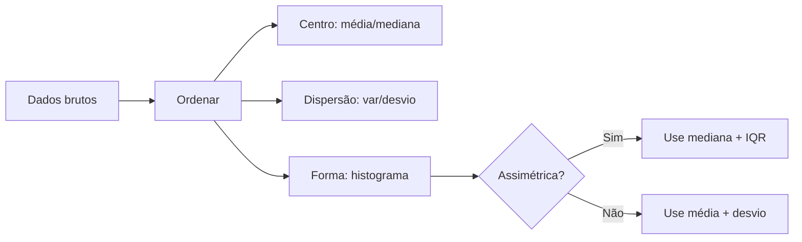

# Estatística Descritiva do Zero

> Média, mediana e variância contam a história que a tabela esconde — aprenda a extraí-la sem pandas.

**Type:** Build
**Languages:** Python
**Prerequisites:** None
**Time:** ~60 minutes

## Learning Objectives

- Calcular média, mediana, moda, variância, desvio-padrão e quartis usando apenas stdlib
- Construir um histograma e boxplot em texto/ASCII antes de usar matplotlib
- Detectar outliers com IQR e z-score e explicar quando cada um falha
- Comparar a distribuição empírica com a normal e interpretar assimetria e curtose

## The Problem

Você recebe um CSV com 10.000 salários. A média é R$ 8.500, mas 70% das pessoas ganham menos que isso. Por quê? Um único CEO com R$ 500k puxou a média. Se você reportar só a média, mente sem querer.

Em data science, resumir dados com uma métrica só é o erro mais comum e mais caro. Antes de qualquer modelo, você precisa descrever: onde está o centro, quanto os dados espalham, qual a forma da distribuição. Sem isso, regressão e deep learning viram caixa-preta.

## The Concept

### Centro: média vs mediana vs moda

```
dados = [2, 3, 3, 5, 500]
média   = (2+3+3+5+500)/5 = 102.6  <- sensível a outlier
mediana = valor do meio ordenado = 3  <- robusta
moda    = valor mais frequente = 3
```

Regra: distribuição simétrica -> média ~= mediana. Assimétrica à direita -> média > mediana (caso salários).

### Dispersão: variância e desvio-padrão

```
variância = média((x - média)^2)
desvio    = sqrt(variância)
```

Desvio responde: "em média, quanto cada ponto se afasta do centro?" Útil para comparar grupos.

### Quartis e IQR (robusto)

Ordene os dados. Q1 = percentil 25, Q2 = mediana, Q3 = percentil 75.
IQR = Q3 - Q1 (amplitude dos 50% centrais).

Regra de Tukey para outliers:
```
limite_inf = Q1 - 1.5*IQR
limite_sup = Q3 + 1.5*IQR
```

### Z-score (paramétrico)

```
z = (x - média) / desvio
```
|z| > 3 = candidato a outlier, mas assume distribuição ~normal. Em dados assimétricos, IQR é melhor.



```figure
stats-descriptive-overview
```

## Build It

### Step 1: Estatísticas centrais e dispersão do zero

```python
import math

def mean(data):
    return sum(data) / len(data)

def median(data):
    s = sorted(data)
    n = len(s)
    mid = n // 2
    return s[mid] if n % 2 == 1 else (s[mid-1] + s[mid]) / 2

def variance(data, sample=False):
    m = mean(data)
    div = len(data) - 1 if sample else len(data)
    return sum((x - m)**2 for x in data) / div

def std(data, sample=False):
    return math.sqrt(variance(data, sample))

def mode(data):
    freq = {}
    for x in data:
        freq[x] = freq.get(x, 0) + 1
    return max(freq, key=freq.get)

data = [2, 3, 3, 5, 500]
print(f"média={mean(data):.1f} mediana={median(data)} moda={mode(data)} std={std(data):.1f}")
```

### Step 2: Quartis e IQR

```python
def percentile(data, p):
    s = sorted(data)
    k = (len(s)-1) * p / 100
    f = math.floor(k)
    c = math.ceil(k)
    if f == c:
        return s[int(k)]
    return s[f] * (c - k) + s[c] * (k - f)

def quartiles(data):
    return percentile(data, 25), percentile(data, 50), percentile(data, 75)

def iqr(data):
    q1, _, q3 = quartiles(data)
    return q3 - q1

q1, q2, q3 = quartiles([1,2,3,4,5,6,7,8,9,100])
print(f"Q1={q1} Q2={q2} Q3={q3} IQR={iqr([1,2,3,4,5,6,7,8,9,100])}")
# outlier: 100 > Q3+1.5*IQR ?
```

### Step 3: Histograma ASCII

```python
def histogram(data, bins=5):
    lo, hi = min(data), max(data)
    width = (hi - lo) / bins
    counts = [0]*bins
    for x in data:
        idx = min(int((x - lo) / width), bins-1) if width else 0
        counts[idx] += 1
    for i, c in enumerate(counts):
        bar = "#" * c
        print(f"{lo + i*width:6.1f} | {bar} ({c})")

histogram([1,1,2,2,2,3,3,5,8,9], bins=4)
```

## Use It

Mesmo cálculo com `numpy`/`statistics`:

```python
import statistics
import numpy as np

data = [2, 3, 3, 5, 500]
print(statistics.mean(data), statistics.median(data), statistics.stdev(data))
print(np.mean(data), np.median(data), np.std(data, ddof=0))
print(np.percentile(data, [25,50,75]))
# histograma real
# import matplotlib.pyplot as plt
# plt.hist(data, bins=10); plt.show()
```

Seu código do zero e numpy devem bater na 2ª casa decimal. Use stdlib para entender, numpy para produção.

## Ship It

Artefato: `outputs/skill-estatistica-descritiva.md` — checklist para todo EDA: "antes de treinar, reporte média/mediana, desvio/IQR, histograma e % de outliers".

## Exercises

1. Gere 1000 amostras de `exp(λ=1)` e compare média vs mediana. Por que divergem?
2. Implemente assimetria (skew) = E[(x-média)^3]/desvio^3 sem libs. Teste em dados simétricos vs assimétricos.
3. Troque a regra IQR de 1.5 para 3.0. Quantos outliers você perde? Quando faz sentido?

## Key Terms

| Term | O que dizem | O que realmente é |
|---|---|---|
| Média | "valor típico" | Soma/n, sensível a outliers; só típica se distribuição simétrica |
| Mediana | "meio dos dados" | Valor que corta 50% abaixo/acima; robusta |
| Desvio-padrão | "erro médio" | Raiz da variância; distância típica até a média |
| IQR | "caixa do boxplot" | Q3-Q1; amplitude dos 50% centrais |
| Z-score | "quantos desvios" | (x-média)/desvio; assume normalidade |
| Outlier | "ponto estranho" | Observação além de Q3+1.5*IQR ou |z|>3 |

## Further Reading

- [Seeing Theory — Descriptive Stats](https://seeing-theory.brown.edu/) — visual interativo
- [NIST Engineering Statistics Handbook](https://www.itl.nist.gov/div898/handbook/) — referência
- [SciPy stats docs](https://docs.scipy.org/doc/scipy/reference/stats.html) — para produção
