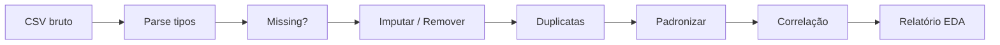

# Limpeza e EDA do Zero

> Dados reais chegam sujos — você conserta missing, duplicatas e tipos antes que o modelo aprenda o erro.

**Type:** Build
**Languages:** Python
**Prerequisites:** 01-estatistica-descritiva
**Time:** ~70 minutes

## Learning Objectives

- Detectar e imputar valores ausentes (média, mediana, moda) sem pandas
- Normalizar tipos, remover duplicatas e padronizar strings manualmente
- Calcular correlação de Pearson do zero e montar matriz de correlação
- Gerar um relatório EDA mínimo reproduzível

## The Problem

Kaggle estima 80% do tempo de um cientista é limpeza. Um CSV com `""`, `"N/A"`, `"null"` e duplicatas faz sua regressão prever lixo. Modelos não consertam dados ruins — eles os amplificam.

## The Concept

### Missing: tipos

- MCAR (perda aleatória) — imputar ok.
- MAR (perda depende de outro campo) — imputar condicional.
- MNAR (perda depende do próprio valor) — imputar viesado.

Estratégias: remover linha, média/mediana/moda, vizinho mais próximo.

### Correlação de Pearson

```
r = cov(X,Y) / (std(X)*std(Y))
cov = mean((x - mx)(y - my))
```
r=1 correlação perfeita, 0 nenhuma, -1 inversa. Só captura relação linear.



```figure
eda-pipeline
```

## Build It

### Step 1: Parsear e detectar missing

```python
def is_missing(v):
    return v is None or str(v).strip().lower() in ("", "na", "n/a", "null", "none", "-")

def column_stats(rows, col):
    vals = [r[col] for r in rows if not is_missing(r[col])]
    nums = [float(v) for v in vals]
    return len(vals), sum(nums)/len(nums) if nums else None
```

### Step 2: Imputação

```python
def impute(rows, col, strategy="median"):
    vals = [float(r[col]) for r in rows if not is_missing(r[col])]
    vals.sort()
    if strategy == "mean":
        fill = sum(vals)/len(vals)
    elif strategy == "median":
        fill = vals[len(vals)//2]
    else: # mode
        fill = max(set(vals), key=vals.count)
    for r in rows:
        if is_missing(r[col]):
            r[col] = fill
    return fill
```

### Step 3: Correlação

```python
def pearson(x, y):
    mx, my = sum(x)/len(x), sum(y)/len(y)
    num = sum((a-mx)*(b-my) for a,b in zip(x,y))
    den = (sum((a-mx)**2 for a in x)*sum((b-my)**2 for b in y))**0.5
    return num/den if den else 0
```

## Use It

```python
import pandas as pd
df = pd.read_csv("data.csv", na_values=["", "N/A", "null"])
print(df.isna().sum())
df["idade"] = df["idade"].fillna(df["idade"].median())
print(df.corr(numeric_only=True))
```

## Ship It

`outputs/skill-limpeza-eda.md` — pipeline de limpeza reprodutível.

## Exercises

1. Implemente imputação por grupo (ex: mediana de salário por departamento).
2. Adicione detecção de duplicatas por chave composta.
3. Compare Pearson vs Spearman em dados com outlier — qual é mais robusto?

## Key Terms

| Term | O que é |
|---|---|
| MCAR | Missing completamente aleatório |
| Imputação | Preencher faltantes com estatística |
| Pearson | Correlação linear [-1,1] |
| EDA | Análise exploratória antes de modelar |

## Further Reading

- [Pandas missing data guide](https://pandas.pydata.org/docs/user_guide/missing_data.html)
- [Hadley Wickham — Tidy Data](https://vita.had.co.nz/papers/tidy-data.pdf)
