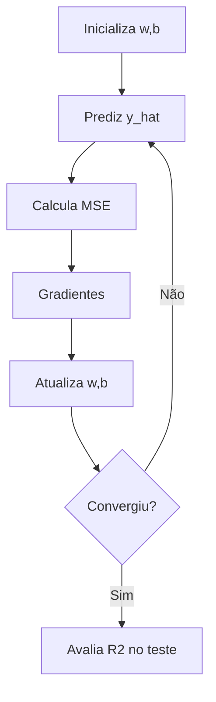

# Regressão Linear do Zero

> Antes do sklearn, você escreve o gradiente à mão — e entende por que a reta se move.

**Type:** Build
**Languages:** Python
**Prerequisites:** 01-estatistica-descritiva, 02-limpeza-e-eda
**Time:** ~75 minutes

## Learning Objectives

- Derivar o gradiente do MSE para `y=wx+b` e implementar regressão linear do zero
- Treinar com gradiente descendente e comparar com a equação normal
- Avaliar com MSE, RMSE e R² e diagnosticar overfitting com split treino/teste
- Estender para regressão múltipla e entender scaling

## The Problem

Prever preço de imóvel dado tamanho. Sem regressão você chuta. Com regressão você aprende a reta que minimiza o erro quadrático. É o "hello world" que introduz todo o ciclo de ML: modelo → custo → otimização.

## The Concept

Modelo: `y = wx + b`. Custo MSE: `(1/n) sum(y_hat - y)^2`.
Gradientes: `dw = (2/n) sum((y_hat-y)x)`, `db = (2/n) sum(y_hat-y)`.
Update: `w -= lr*dw`.

Normal equation: `w = (X^T X)^{-1} X^T y` — solução fechada, O(n³) em features.

R² = 1 - SS_res/SS_tot (quanto da variância é explicada).



```figure
linear-regression-fit
```

## Build It

Ver `code/main.py`: `LinearRegression` com `fit`, `predict`, `r2`. Inclui múltipla e Ridge preview.

## Use It

```python
from sklearn.linear_model import LinearRegression
model = LinearRegression().fit(X_train, y_train)
print(model.coef_, model.intercept_, model.score(X_test, y_test))
```

## Ship It

`outputs/skill-regressao.md` — quando usar gradiente vs normal, quando escalar, quando regularizar.

## Exercises

1. Implemente SGD vs batch GD.
2. Teste grau 10 em dados quadráticos — mostre overfitting.
3. Implemente Ridge (L2).

## Key Terms

| Term | Significado |
|---|---|
| MSE | Erro quadrático médio |
| R² | Variância explicada |
| Learning rate | Passo do gradiente |
| Scaling | Padronizar para convergir |

## Further Reading

- [ISLR cap 3](https://www.statlearning.com/)
- [CS229 notes](https://cs229.stanford.edu/main_notes.pdf)
