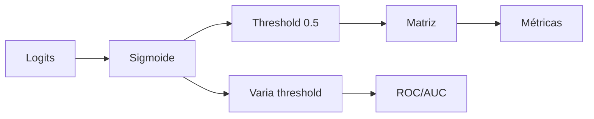

# Classificação e Avaliação

> Acurácia mente em dados desbalanceados — você precisa de precisão, recall e ROC.

**Type:** Build
**Languages:** Python
**Prerequisites:** 03-regressao-do-zero
**Time:** ~70 minutes

## Learning Objectives

- Implementar regressão logística com sigmoide e entropia cruzada do zero
- Construir matriz de confusão e derivar acurácia, precisão, recall, F1
- Traçar curva ROC e calcular AUC manualmente
- Escolher threshold ótimo e explicar trade-off precisão vs recall

## The Problem

Modelo com 95% de acurácia parece ótimo — até descobrir que 95% dos casos são negativos e ele sempre prevê negativo. Em fraude, câncer, churn, o custo do falso negativo é alto. Avaliação errada = decisão errada.

## The Concept

Sigmoide: `σ(z)=1/(1+e^-z)`, mapeia para (0,1).
Custo: BCE = -[y log(p) + (1-y)log(1-p)].
Gradiente: `dw = (1/n) sum((p-y)x)`.

Matriz:
```
        Pred 0  Pred 1
Real 0   TN      FP
Real 1   FN      TP
```
Precisão = TP/(TP+FP), Recall = TP/(TP+FN), F1 = 2PR/(P+R).

ROC: varia threshold 0→1, plota TPR vs FPR. AUC = área sob curva.



```figure
roc-curve
```

## Build It

```python
def sigmoid(z): return 1/(1+math.exp(-z))
def bce(y,p): return -(y*math.log(p+1e-15)+(1-y)*math.log(1-p+1e-15))
# treino: p=sigmoid(w*x+b), erro=p-y
```

Ver `code/main.py` completo.

## Use It

```python
from sklearn.linear_model import LogisticRegression
from sklearn.metrics import classification_report, roc_auc_score
model = LogisticRegression().fit(X_train, y_train)
print(classification_report(y_test, model.predict(X_test)))
print(roc_auc_score(y_test, model.predict_proba(X_test)[:,1]))
```

## Ship It

`outputs/skill-avaliacao.md` — guia de métricas por caso de uso.

## Exercises

1. Mude threshold para maximizar F1.
2. Simule desbalanceamento 95/5 e compare acurácia vs F1.
3. Implemente k-fold CV.

## Key Terms

| Term | Definição |
|---|---|
| Precisão | Fração de positivos previstos que são reais |
| Recall | Fração de positivos reais capturados |
| F1 | Média harmônica P/R |
| AUC | Probabilidade de ordenar positivo acima de negativo |

## Further Reading

- [Google ML — Classification](https://developers.google.com/machine-learning/crash-course/classification)
- [Sklearn metrics](https://scikit-learn.org/stable/modules/model_evaluation.html)
