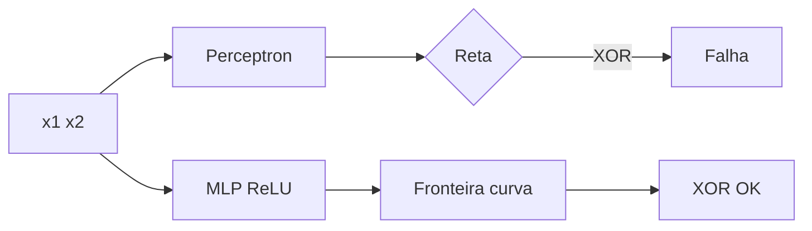

# Perceptron e Deep Learning do Zero

> De uma linha que separa pontos até uma rede que aprende — tudo com numpy.

**Type:** Build
**Languages:** Python
**Prerequisites:** 03-regressao-do-zero, 04-classificacao-e-avaliacao
**Time:** ~80 minutes

## Learning Objectives

- Implementar o perceptron (regra de Rosenblatt) e provar quando converge/diverge
- Estender para MLP com ReLU/sigmoide, forward e backprop manual
- Treinar com gradiente descendente e comparar com `torch.nn.Linear`
- Visualizar fronteira de decisão e explicar por que perceptron falha no XOR

## The Problem

Regressão logística separa com reta. Mas e dados em círculo ou XOR? Uma reta não resolve. Deep learning empilha retas (camadas) + não-linearidades (ReLU) para criar fronteiras curvas. Entender o perceptron é entender por que profundidade importa.

## The Concept

Perceptron: `y = sign(w·x + b)`, update: `w += lr*(y_true - y_pred)*x`.

Limite: só separa linearmente. XOR exige camada oculta.

MLP 1 oculta: `h=ReLU(W1 x + b1)`, `y=sigmoid(W2 h + b2)`. Backprop encadeia derivadas.

ReLU: `max(0,z)` — gradiente 1 se z>0, 0 caso contrário. Evita saturação da sigmoide.



```figure
perceptron-vs-mlp
```

## Build It

Ver `code/main.py`: perceptron + MLP 2 camadas com backprop numpy. Testa em AND e XOR.

## Use It

```python
import torch
model = torch.nn.Sequential(torch.nn.Linear(2,8), torch.nn.ReLU(), torch.nn.Linear(8,1), torch.nn.Sigmoid())
# treino com torch.optim.SGD
```

Seu MLP numpy deve empatar com PyTorch em <5% de acurácia no XOR.

## Ship It

`outputs/skill-perceptron.md` — quando usar linear vs MLP, como debugar fronteira.

## Exercises

1. Mostre que perceptron não converge em XOR (prove).
2. Troque ReLU por sigmoide na oculta — o que muda no treino?
3. Adicione 2ª camada oculta e meça ganho.

## Key Terms

| Term | Definição |
|---|---|
| Perceptron | Classificador linear com update erro-dirigido |
| ReLU | max(0,z) |
| Backprop | Regra da cadeia para gradientes |
| XOR | Problema não-linear que exige oculta |

## Further Reading

- [Rosenblatt 1958 — Perceptron](https://psycnet.apa.org/record/1959-09865-001)
- [3Blue1Brown — Neural Networks](https://www.3blue1brown.com/topics/neural-networks)
- [PyTorch basics](https://pytorch.org/tutorials/beginner/basics/intro.html)
