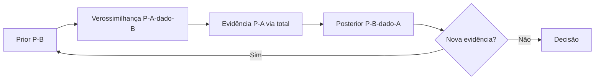

# Probabilidade do Zero: Condicional, Total e Bayes

> O teste deu positivo — qual a chance real de você estar doente? Sem Bayes, você erra por 10x.

**Type:** Build
**Languages:** Python
**Prerequisites:** 01-estatistica-descritiva
**Time:** ~60 minutes

## Learning Objectives

- Calcular probabilidade condicional P(A|B) e testar independência com a regra do produto
- Aplicar a lei da probabilidade total para decompor um evento em cenários mutuamente exclusivos
- Derivar e aplicar o teorema de Bayes para inverter condicionais (teste médico, spam, churn)
- Construir uma PMF discreta do zero e calcular esperança e variância sem libs

## The Problem

Um teste de doença rara tem 99% de sensibilidade e 95% de especificidade. A doença atinge 1 em cada 1000 pessoas. Seu teste deu positivo. Qual a chance de você estar doente?

O instinto diz 99%. A resposta correta é ~2%. O erro — confundir P(positivo|doente) com P(doente|positivo) — se chama falácia da taxa-base, e aparece em churn, fraude, spam e qualquer classificador com classe rara. Sem probabilidade condicional, você interpreta todo modelo errado.

## The Concept

### Probabilidade condicional

```
P(A|B) = P(A ∩ B) / P(B),  com P(B) > 0
```

Leia: "probabilidade de A dado que B aconteceu". Restringe o universo aos casos onde B ocorreu.

Exemplo: dado justo, B = "saiu par" {2,4,6}, A = "saiu 6". P(A|B) = (1/6)/(3/6) = 1/3.

### Independência

A e B são independentes se o conhecimento de B não muda a chance de A:

```
P(A|B) = P(A)  <=>  P(A ∩ B) = P(A) · P(B)
```

Dois lançamentos de moeda: P(cara no 2º | cara no 1º) = 1/2 = P(cara). Independentes. Mas "chover" e "levar guarda-chuva" não são.

### Lei da probabilidade total

Se B1..Bn particionam o espaço (mutuamente exclusivos, cobrem tudo):

```
P(A) = Σ P(A|Bi) · P(Bi)
```

Exemplo: P(positivo) = P(positivo|doente)·P(doente) + P(positivo|saudável)·P(saudável).

### Teorema de Bayes

Inverte a condicional combinando as duas fórmulas acima:

```
P(B|A) = P(A|B) · P(B) / P(A)
```

No teste médico: P(doente|positivo) = 0.99·0.001 / (0.99·0.001 + 0.05·0.999) ≈ 0.0194 ≈ 2%.



```figure
stats-probability-bayes
```

## Build It

### Step 1: Condicional e independência do zero

```python
def cond_prob(p_ab, p_b):
    if p_b <= 0:
        raise ValueError("P(B) deve ser > 0")
    return p_ab / p_b

def joint_if_independent(p_a, p_b):
    return p_a * p_b

def is_independent(p_a, p_b, p_ab, tol=1e-9):
    return abs(p_ab - p_a * p_b) <= tol

print(cond_prob(1/6, 3/6))          # 0.333: P(6 | par)
print(is_independent(0.5, 0.5, 0.25))  # True: duas moedas
```

### Step 2: Probabilidade total

```python
def total_prob(cond_probs, priors):
    # cond_probs[i] = P(A|Bi), priors[i] = P(Bi)
    if abs(sum(priors) - 1.0) > 1e-9:
        raise ValueError("priors devem somar 1")
    return sum(c * p for c, p in zip(cond_probs, priors))

p_pos = total_prob([0.99, 0.05], [0.001, 0.999])
print(f"P(positivo) = {p_pos:.4f}")  # ~0.0509
```

### Step 3: Bayes + PMF, esperança e variância

```python
def bayes(p_a_given_b, p_b, p_a):
    return p_a_given_b * p_b / p_a

print(f"P(doente|+) = {bayes(0.99, 0.001, p_pos):.4f}")  # ~0.0194

def pmf(values, probs):
    if abs(sum(probs) - 1.0) > 1e-9:
        raise ValueError("probs devem somar 1")
    return dict(zip(values, probs))

def expected_value(d):
    return sum(x * p for x, p in d.items())

def variance_dist(d):
    mu = expected_value(d)
    return sum(((x - mu) ** 2) * p for x, p in d.items())

dado = pmf([1,2,3,4,5,6], [1/6]*6)
print(expected_value(dado), variance_dist(dado))  # 3.5, ~2.917
```

## Use It

O mesmo cálculo com `fractions` (exato) ou contagem empírica:

```python
from fractions import Fraction

# Bayes exato com frações
p = Fraction(99,100) * Fraction(1,1000) / (
    Fraction(99,100)*Fraction(1,1000) + Fraction(5,100)*Fraction(999,1000))
print(p, float(p))  # ~0.0194

# Verificação empírica por simulação (lei dos grandes números)
import random
random.seed(0)
n = 200_000
doente_pos = sum(1 for _ in range(n)
                 if random.random() < 0.001 and random.random() < 0.99)
saud_pos = sum(1 for _ in range(n)
               if random.random() >= 0.001 and random.random() < 0.05)
print(doente_pos / (doente_pos + saud_pos))  # ~0.02
```

Simulação e fórmula devem concordar na 2ª casa decimal com n grande.

## Ship It

Artefato: `outputs/skill-probabilidade.md` — checklist "toda vez que inverter uma condicional, declare prior, verossimilhança e evidência antes de concluir".

## Exercises

1. Um filtro de spam marca 98% dos spams e 2% dos não-spams. Se 30% dos emails são spam, qual P(spam|marcado)? Implemente com `bayes()`.
2. Prove com código que P(A|B) = P(B|A) só vale quando P(A) = P(B). Dê um contra-exemplo numérico.
3. Construa a PMF de "soma de dois dados" e calcule esperança e variância com `expected_value()` e `variance_dist()`.

## Key Terms

| Term | O que dizem | O que realmente é |
|---|---|---|
| Condicional P(A\|B) | "chance de A se B" | P(A∩B)/P(B); restringe o universo a B |
| Independência | "sem relação" | P(A∩B)=P(A)·P(B); saber B não muda A |
| Probabilidade total | "média ponderada" | P(A)=Σ P(A\|Bi)·P(Bi) sobre partição |
| Teorema de Bayes | "inverter a pergunta" | P(B\|A)=P(A\|B)·P(B)/P(A) |
| PMF | "tabela de chances" | P(X=x) para cada valor discreto; soma 1 |
| Esperança | "média teórica" | Σ x·P(x); para onde a média amostral converge |

## Further Reading

- [Seeing Theory — Probability](https://seeing-theory.brown.edu/) — visual interativo
- [Stat Trek: Bayes Theorem](https://stattrek.com/probability/bayes-theorem) — referência com exemplos
- [Python `fractions` docs](https://docs.python.org/3/library/fractions.html) — cálculo exato para produção
