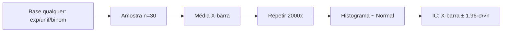

# Distribuições e o Teorema Central do Limite

> Por que a média de 30 dados "quase normais" explica o intervalo de confiança de todo modelo?

**Type:** Build
**Languages:** Python
**Prerequisites:** 01-estatistica-descritiva, 06-probabilidade-fundamentos
**Time:** ~60 minutes

## Learning Objectives

- Implementar PMF/PDF de Bernoulli, Binomial, Poisson, Normal e Exponencial usando só `math`
- Amostrar de cada distribuição com `random` e validar média/variância teóricas
- Simular o Teorema Central do Limite: a média amostral converge para a normal
- Comparar a implementação do zero com `numpy`/`statistics` quando disponível

## The Problem

Você mede o tempo de resposta de uma API: média 200ms, mas picos de 5s. É "normal"? Posso usar média ± 2·desvio como intervalo? Se a distribuição base é exponencial (assimétrica), a resposta individual não é normal — mas a média de 30 requisições é. Confundir "dados normais" com "média amostral normal" gera intervalos de confiança errados, testes A/B inválidos e SLOs furados.

## The Concept

### Discretas: Bernoulli → Binomial → Poisson

- **Bernoulli(p):** 1 sucesso com prob. p. E[X]=p, Var=p(1-p).
- **Binomial(n,p):** soma de n Bernoullis. `P(X=k) = C(n,k)·p^k·(1-p)^(n-k)`, E=np, Var=np(1-p).
- **Poisson(λ):** eventos raros por intervalo. `P(X=k) = λ^k·e^-λ/k!`, E=Var=λ. Limite da Binomial quando n grande, p pequeno, np=λ.

### Contínuas: Normal e Exponencial

- **Normal(μ,σ):** `f(x) = e^(-(x-μ)²/2σ²)/(σ√2π)`. Simétrica; regra 68-95-99.7.
- **Exponencial(λ):** tempo entre eventos de Poisson. `f(x) = λ·e^(-λx)` (x≥0), E=1/λ, Var=1/λ². Sem memória: P(T>s+t|T>s)=P(T>t).

### Teorema Central do Limite (TCL)

Se X1..Xn são i.i.d. com média μ e variância σ² finita, então:

```
X̄ ~ Normal(μ, σ²/n)  quando n cresce
```

Vale para qualquer base (uniforme, exponencial, binomial) — por isso médias de n≥30 se tratam como normais em testes A/B.



```figure
stats-distribuicoes-tcl
```

## Build It

### Step 1: PMF/PDF do zero (só `math`)

```python
import math

def bernoulli_pmf(k, p):
    return p if k == 1 else (1 - p if k == 0 else 0.0)

def binom_pmf(k, n, p):
    if not 0 <= k <= n:
        return 0.0
    return math.comb(n, k) * p**k * (1-p)**(n-k)

def poisson_pmf(k, lam):
    return lam**k * math.exp(-lam) / math.factorial(k)

def normal_pdf(x, mu=0.0, sigma=1.0):
    return math.exp(-((x-mu)**2)/(2*sigma**2)) / (sigma * math.sqrt(2*math.pi))

def expon_pdf(x, lam):
    return lam * math.exp(-lam*x) if x >= 0 else 0.0

print(binom_pmf(2, 10, 0.5))   # ~0.0439 (= 45/1024)
print(poisson_pmf(3, 2.0))     # ~0.180
print(normal_pdf(0))           # ~0.399
```

### Step 2: Amostragem com `random`

```python
import random

def sample_bernoulli(p, rng):
    return 1 if rng.random() < p else 0

def sample_binomial(n, p, rng):
    return sum(sample_bernoulli(p, rng) for _ in range(n))

def sample_poisson(lam, rng):
    # Knuth: conta eventos até exceder e^-λ
    L = math.exp(-lam)
    k, prod = 0, 1.0
    while True:
        k += 1
        prod *= rng.random()
        if prod <= L:
            return k - 1

def sample_expon(lam, rng):
    return -math.log(1 - rng.random()) / lam  # inversa da CDF

def sample_normal(mu, sigma, rng):
    return rng.gauss(mu, sigma)  # Box-Muller interno do CPython

rng = random.Random(0)
print([sample_binomial(10, 0.5, rng) for _ in range(5)])
```

### Step 3: Simular o TCL

```python
def sample_means(sampler, n, reps, rng):
    return [sum(sampler() for _ in range(n)) / n for _ in range(reps)]

rng = random.Random(42)
means = sample_means(lambda: rng.expovariate(1.0), n=30, reps=2000, rng=rng)
m = sum(means) / len(means)
v = sum((x-m)**2 for x in means) / len(means)
print(f"base exp(1): E[X̄]={m:.3f} (→1.0) Var={v:.4f} (→1/30≈0.0333)")
```

## Use It

Conferência com `numpy`/`statistics` (opcional):

```python
try:
    import numpy as np
    rng = np.random.default_rng(0)
    s = rng.binomial(10, 0.5, size=50_000)
    print(f"[numpy] binomial(10,.5): média={s.mean():.3f} (→5.0) var={s.var():.3f} (→2.5)")
    e = rng.exponential(1.0, size=(2000, 30)).mean(axis=1)
    print(f"[numpy] TCL exp: E[X̄]={e.mean():.3f} Var={e.var():.4f}")
except ImportError:
    print("numpy não instalado — comparação pulada (pip install numpy)")
```

Seu `math.comb`/fatorial e o numpy devem concordar na 3ª casa para PMFs.

## Ship It

Artefato: `outputs/skill-distribuicoes.md` — guia "qual distribuição usar + quando o TCL autoriza intervalo normal".

## Exercises

1. Mostre numericamente que Binomial(n=100, p=0.02) ≈ Poisson(λ=2): compare as PMFs k=0..5.
2. Refaça a simulação do TCL com base uniforme `random.random()`: E[X̄]→0.5 e Var→1/(12·30)?
3. Quebra do TCL: use base Cauchy (`tan(pi*(u-0.5))`). O histograma das médias "normaliza"? Por quê? (Dica: variância infinita.)

## Key Terms

| Term | O que dizem | O que realmente é |
|---|---|---|
| Bernoulli | "cara ou coroa" | Bloco atômico 0/1 com prob. p |
| Binomial | "k sucessos em n" | Soma de Bernoullis; C(n,k)p^k(1-p)^(n-k) |
| Poisson | "eventos raros" | Limite da Binomial; E=Var=λ |
| Normal | "curva sino" | PDF gaussiana; 68-95-99.7 em ±1/2/3σ |
| Exponencial | "tempo de espera" | Intervalo entre Poissons; sem memória |
| TCL | "média vira normal" | X̄→Normal(μ,σ²/n); exige variância finita |

## Further Reading

- [Seeing Theory — Distributions & CLT](https://seeing-theory.brown.edu/) — visual interativo
- [SciPy stats docs](https://docs.scipy.org/doc/scipy/reference/stats.html) — para produção
- [NIST: Probability Distributions](https://www.itl.nist.gov/div898/handbook/eda/section3/eda366.htm) — referência
