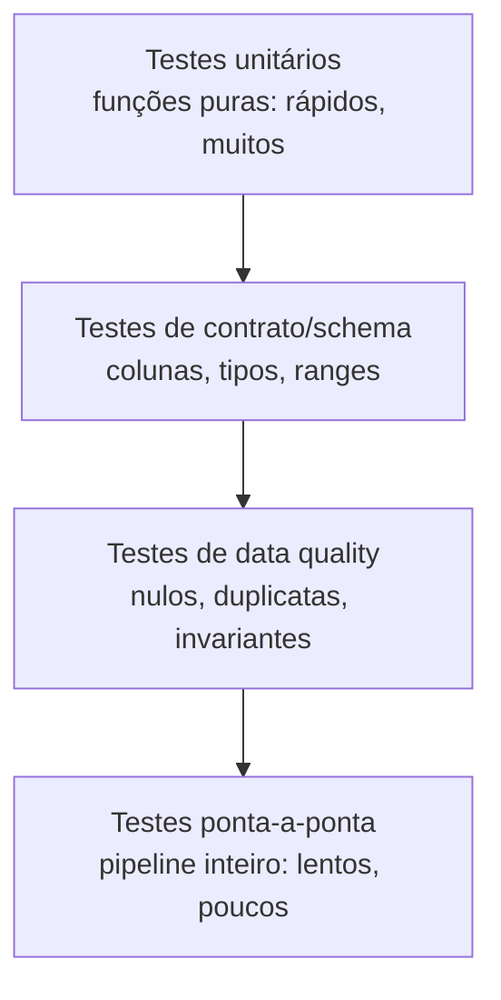

# Clean Code e Testes para Data Science

> O notebook roda na sua máquina e quebra em produção — aprenda a transformar análise exploratória em pipeline testável.

**Type:** Build
**Languages:** Python
**Prerequisites:** 01-estatistica-descritiva, 02-limpeza-e-eda
**Time:** ~60 minutes

## Learning Objectives

- Explicar por que notebooks quebram em produção (estado oculto, execução fora de ordem, dependências implícitas)
- Refatorar um notebook monolítico em pipeline modular com funções puras e contratos de schema
- Aplicar SRP, DRY e validação na borda em código de dados com stdlib
- Escrever testes de data quality (schema, nulos, ranges, invariantes) com unittest
- Interpretar a pirâmide de testes aplicada a DS: unitários rápidos, contrato/schema, ponta-a-ponta lentos

## The Problem

Você entrega um notebook que roda perfeito na sua máquina. O colega executa "Run All" e quebra na célula 7: uma variável foi sobrescrita na célula 12 executada fora de ordem, uma coluna `idade` veio como string `"32"` em vez de int, e um `dropna()` silencioso removeu 40% das linhas. Em produção, o job agendado falha à meia-noite sem mensagem útil.

Notebooks otimizam exploração, não repetição. Estado global mutável, células executadas fora de ordem e tipos implícitos tornam o resultado não-determinístico. O custo aparece depois: retrabalho, modelo treinado com dados corrompidos, decisão errada. A saída é tratar código de dados como software: funções pequenas, entradas validadas, comportamento testado.

## The Concept

### Funções puras: mesma entrada, mesma saída

Uma função pura não lê nem escreve global, não depende da ordem de execução:

```python
# impuro: depende de global e muta o argumento
THRESHOLD = 18
def filtrar_adultos(rows):
    return [r for r in rows if r["idade"] >= THRESHOLD]  # quebra se idade for str

# puro: dependências explícitas, sem mutação
def filtrar_adultos(rows, idade_minima=18):
    return [{**r} for r in rows if int(r["idade"]) >= idade_minima]
```

Regras práticas: um verbo por função (`load`, `validate`, `clean`, `featurize`), sem I/O no meio do pipeline (I/O só nas bordas), retorno novo em vez de mutar.

### SOLID em versão DS (só o que importa aqui)

- **S — Single Responsibility:** `validate_schema()` valida, `clean()` limpa. Nunca os dois juntos.
- **D — Dependency Inversion (na prática):** a etapa recebe o que precisa por parâmetro (threshold, colunas), não importa global.
- **Contrato na borda:** valide o schema logo na entrada (colunas presentes, tipos convertíveis). Falhe rápido com mensagem que diz a linha e a coluna.

### Pirâmide de testes para dados



A base (unitários + schema) roda em segundos a cada commit. O topo (pipeline inteiro com dados reais) roda no CI/noturno. Se a base é fraca, todo erro estoura só em produção.

```figure
clean-code-pipeline-overview
```

## Build It

### Step 1: Represente a tabela como lista-de-dicts e valide o schema

Sem pandas: cada linha é um `dict`, a tabela é uma `list[dict]`.

```python
SCHEMA = {
    "nome": str,
    "idade": int,   # aceita "32" conversível
    "salario": float,
}

def validate_schema(rows, schema):
    errors = []
    for i, row in enumerate(rows):
        for col, tipo in schema.items():
            if col not in row:
                errors.append(f"linha {i}: coluna ausente '{col}'")
                continue
            try:
                tipo(row[col])
            except (ValueError, TypeError):
                errors.append(f"linha {i}: '{col}'={row[col]!r} não converte para {tipo.__name__}")
    return errors
```

### Step 2: Pipeline modular com funções puras

```python
def clean_rows(rows):
    out = []
    for r in rows:
        novo = {"nome": str(r["nome"]).strip(), "idade": int(r["idade"]), "salario": float(r["salario"])}
        if novo["idade"] >= 0 and novo["salario"] >= 0:
            out.append(novo)
    return out

def featurize(rows):
    return [{**r, "adulto": r["idade"] >= 18} for r in rows]

def run_pipeline(rows):
    errors = validate_schema(rows, SCHEMA)
    if errors:
        raise ValueError("schema inválido:\n" + "\n".join(errors[:5]))
    return featurize(clean_rows(rows))
```

### Step 3: Testes de data quality

```python
def check_quality(rows):
    checks = {
        "sem_nulos": all(v is not None and v != "" for r in rows for v in r.values()),
        "idades_validas": all(0 <= r["idade"] <= 120 for r in rows),
        "sem_duplicatas": len({(r["nome"], r["idade"]) for r in rows}) == len(rows),
    }
    return checks
```

Cada check retorna booleano nomeado: quando falha, você sabe exatamente qual invariante quebrou.

## Use It

O mesmo padrão com a biblioteca de produção (`pandera` para schemas, `pytest` como runner):

```python
# import pandera.pandas as pa
# import pandas as pd
# from pandera import Column, DataFrameSchema, Check
#
# schema = DataFrameSchema({
#     "nome": Column(str),
#     "idade": Column(int, Check.between(0, 120)),
#     "salario": Column(float, Check.ge(0)),
# })
# df = pd.DataFrame([{"nome": "ana", "idade": 30, "salario": 5000.0}])
# print(schema.validate(df))
# # pytest: mesmos asserts do unittest, com fixtures e mensagens melhores
```

Seu validador stdlib e `pandera` devem concordar: linha válida passa nos dois, linha inválida falha nos dois. Use stdlib para entender, pandera/pytest para produção.

## Ship It

Artefato: `outputs/skill-clean-code-ds.md` — checklist para converter qualquer notebook em pipeline: "funções puras, schema na borda, quality checks nomeados, testes rápidos embaixo e ponta-a-ponta em cima".

## Exercises

1. Quebre propositalmente: passe `idade="trinta"` e uma linha sem `salario`. A mensagem de erro diz linha e coluna?
2. Adicione um check `salario_mediano_positivo` e um teste que falha quando todos os salários são 0. Por que invariante de negócio vale mais que teste de tipo?
3. Converta uma função sua que muta global em função pura (parâmetros explícitos, retorno novo). Quantos testes novos ficaram triviais?

## Key Terms

| Term | O que dizem | O que realmente é |
|---|---|---|
| Função pura | "função limpa" | Mesma entrada -> mesma saída, sem global nem mutação; testável em isolamento |
| Schema | "formato dos dados" | Contrato de colunas + tipos; validado na borda, falha rápido |
| Data quality check | "teste de dados" | Invariante nomeado (nulos, ranges, duplicatas) que explica o que quebrou |
| SRP | "uma coisa só" | Cada função/etapa tem um único motivo para mudar |
| Pirâmide de testes | "testar tudo" | Muitos testes rápidos na base (unit/schema), poucos lentos no topo (e2e) |
| Falhe rápido | "validar cedo" | Erro na entrada com mensagem útil em vez de corrupção silenciosa adiante |

## Further Reading

- [PEP 8 — Style Guide](https://peps.python.org/pep-0008/) — convenções oficiais
- [unittest docs](https://docs.python.org/3/library/unittest.html) — runner stdlib
- [Pandera docs](https://pandera.readthedocs.io/) — validação de schema em produção
