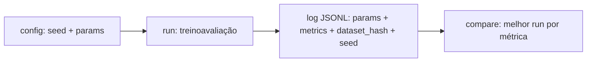

# Reprodutibilidade e Tracking de Experimentos

> "Funcionou ontem" não é resultado científico — aprenda a fixar seeds, versionar datasets e registrar cada run.

**Type:** Build
**Languages:** Python
**Prerequisites:** 01-estatistica-descritiva, 08-clean-code-testes-ds
**Time:** ~60 minutes

## Learning Objectives

- Explicar as três fontes de não-determinismo: seed não fixada, dataset sem versão, hiperparâmetros não registrados
- Fixar seeds de `random` (e `numpy`/`torch` no Use It) para repetir splits e amostragens
- Versionar um dataset com hash SHA-256 do conteúdo canônico
- Registrar runs (params + metrics + dataset_hash) em JSONL com stdlib
- Comparar runs e escolher o melhor por métrica com função pura

## The Problem

Você roda o treino duas vezes e obtém acurácias 0.87 e 0.83 sem mudar nada. Qual reportar? Pior: um mês depois, o dataset foi atualizado, o notebook foi editado, e ninguém sabe qual combinação gerou o 0.87. O "melhor modelo" vira lenda urbana.

Sem seed fixada, cada shuffle/split/amostragem muda. Sem hash do dataset, você não sabe em quais dados treinou. Sem log de params/metrics, não há como comparar nem auditar. Reprodutibilidade não é burocracia: é a diferença entre experimento e anedota.

## The Concept

### Seed: o ponto de partida do aleatório

Geradores pseudo-aleatórios são determinísticos dada a seed:

```python
import random
random.seed(42)
print(random.random())  # sempre 0.6394267984578837
```

Fixe a seed uma vez no início (`set_seed(42)`) e todo sorteio depois dela repete. Seeds diferentes = experimentos diferentes; por isso a seed também é um param registrado.

### Versão de dataset = hash do conteúdo

Nome de arquivo mente (`dados_final_v2_REAL.csv`). Hash não:

```
versão = sha256(representação_canônica_das_linhas)
```

Duas tabelas com mesmo hash têm o mesmo conteúdo, byte a byte. Mudou uma vírgula, muda o hash. É assim que você prova "treinei nestes dados".

### Tracker minimalista: uma linha JSON por run



Cada run registra `timestamp`, `seed`, `dataset_hash`, `params`, `metrics`. O arquivo JSONL é append-only: histórico imutável, legível por qualquer ferramenta.

```figure
reproducibility-tracking-overview
```

## Build It

### Step 1: Fixe a seed e faça split determinístico

```python
import random

def set_seed(seed):
    random.seed(seed)

def train_test_split(rows, test_ratio=0.2, seed=42):
    rng = random.Random(seed)  # instância local: não polui o global
    idx = list(range(len(rows)))
    rng.shuffle(idx)
    k = int(len(rows) * (1 - test_ratio))
    return [rows[i] for i in idx[:k]], [rows[i] for i in idx[k:]]
```

Mesma seed + mesmos dados = mesmo split, sempre.

### Step 2: Hash canônico do dataset

```python
import hashlib, json

def dataset_hash(rows):
    canon = json.dumps(rows, sort_keys=True, ensure_ascii=False)
    return hashlib.sha256(canon.encode("utf-8")).hexdigest()[:12]
```

`sort_keys=True` garante ordem canônica das chaves; o prefixo de 12 chars basta como versão legível.

### Step 3: Tracker JSONL

```python
import json, datetime

def log_run(path, params, metrics, seed, dhash):
    record = {
        "timestamp": datetime.datetime.now(datetime.timezone.utc).isoformat(),
        "seed": seed, "dataset_hash": dhash,
        "params": params, "metrics": metrics,
    }
    with open(path, "a", encoding="utf-8") as f:
        f.write(json.dumps(record, ensure_ascii=False) + "\n")
    return record

def load_runs(path):
    with open(path, encoding="utf-8") as f:
        return [json.loads(line) for line in f if line.strip()]

def best_run(runs, metric="accuracy", higher=True):
    return (max if higher else min)(runs, key=lambda r: r["metrics"][metric])
```

## Use It

O mesmo com a stack de produção (`mlflow` citado, `numpy` para seeds):

```python
# import mlflow, numpy as np
#
# np.random.seed(42)  # além de random.seed(42)
# # import torch; torch.manual_seed(42)
#
# # mlflow.start_run()
# # mlflow.log_params({"lr": 0.01, "seed": 42, "dataset_hash": "abc..."})
# # mlflow.log_metric("accuracy", 0.87)
# # mlflow.end_run()
```

Seu tracker JSONL e o mlflow registram o mesmo contrato: params + metrics + dataset_hash + seed. Use stdlib para entender, mlflow/Weights&Biases para produção.

## Ship It

Artefato: `outputs/skill-reprodutibilidade-tracking.md` — checklist de todo experimento: "seed fixada e registrada, dataset com hash, um JSON por run, melhor run selecionada por função pura".

## Exercises

1. Rode `train_test_split` duas vezes com seed 42 e uma com seed 7. Quais splits são idênticos?
2. Mude um valor no dataset e recalcule o hash. O que acontece? Por que `sort_keys=True` importa?
3. Logue 3 runs variando um param, depois use `best_run` com `higher=False` numa métrica de erro. O vencedor muda?

## Key Terms

| Term | O que dizem | O que realmente é |
|---|---|---|
| Seed | "número mágico" | Estado inicial do gerador pseudo-aleatório; fixa toda a sequência sorteada |
| Dataset hash | "versão dos dados" | SHA-256 do conteúdo canônico; prova em quais dados você treinou |
| Run | "um treino" | Uma execução com seed + params + dataset fixos e métricas registradas |
| JSONL | "log de runs" | Um objeto JSON por linha, append-only; histórico auditável |
| Tracking | "acompanhar modelo" | Registrar params/metrics/versões para comparar e reproduzir |
| Determinismo | "sempre igual" | Mesma seed + mesmos dados + mesmo código = mesmo resultado |

## Further Reading

- [MLflow Tracking docs](https://mlflow.org/docs/latest/tracking.html) — padrão de produção
- [hashlib docs](https://docs.python.org/3/library/hashlib.html) — referência stdlib
- [NumPy random seed docs](https://numpy.org/doc/stable/reference/random/index.html) — seeds em produção
